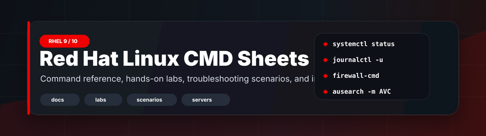

<p align="center">
  
</p>

<p align="center">
  <a href="LICENSE"></a>
  
  
  
</p>

# Red Hat Linux Command Sheets

A polished RHEL 9 and RHEL 10 learning repository for command practice, server setup, troubleshooting, job preparation, and interview revision.

This root `README.md` is the front desk. Deep notes, labs, command sheets, scenarios, and interview answers live in their own sections.

## Start Fast

| I want to... | Start here | Best next step |
| --- | --- | --- |
| Learn RHEL from zero | [Syllabus](syllabus/README.md) | Follow the module order |
| Practice commands | [Labs](labs/README.md) | Use a disposable VM |
| Fix real issues | [Scenarios](scenarios/README.md) | Practice diagnostic flow |
| Find a command fast | [Command index](cheatsheets/command-index.md) | Search by topic |
| Configure a service | [Server recipes](servers/README.md) | Verify ports, firewall, SELinux |
| Prepare for interviews | [Interview Q&A](interview/README.md) | Rehearse spoken answers |

## Repository Map

| Section | What It Contains | Best For |
| --- | --- | --- |
| [docs](docs/README.md) | Topic-wise admin command sheets | Daily learning and reference |
| [labs](labs/README.md) | Hands-on VM practice | Skill building and job prep |
| [scenarios](scenarios/README.md) | Real troubleshooting cases | Interview and incident thinking |
| [servers](servers/README.md) | Service setup recipes | Web, DB, DNS, DHCP, NFS, Samba, mail |
| [cheatsheets](cheatsheets/README.md) | Compact lookup tables | Quick revision |
| [syllabus](syllabus/README.md) | Structured learning path | Full study plan |
| [interview](interview/README.md) | Questions and answers | Technical interviews |
| [notes](notes/README.md) | Admin habits and revision notes | Practical mental models |
| [assets](assets/README.md) | README visuals | Repository presentation |

## Learning Path

```text
Syllabus -> Core Docs -> Labs -> Scenarios -> Interview Q&A -> Server Recipes
```

| Phase | Goal | Proof You Are Ready |
| --- | --- | --- |
| Foundation | Shell, files, users, packages | You can explain basic commands |
| Admin Core | systemd, network, firewall, SELinux, storage | You can configure and verify a VM |
| Services | SSH, web, DB, containers, logs | You can deploy common roles |
| Troubleshooting | Logs, ports, DNS, fstab, repos | You can diagnose without guessing |
| Interview | Spoken answers and scenarios | You can explain what you check first |

## Safety First

Many commands in this repository change system state. Practice in a VM and replace placeholders such as `<hostname>`, `<interface>`, `<device>`, `<mountpoint>`, `<user>`, and `<service>` before running commands.

## Official References

- RHEL 10 documentation: <https://docs.redhat.com/en/documentation/red-hat-enterprise-linux>
- RHEL 9 documentation: <https://docs.redhat.com/en/documentation/red_hat_enterprise_linux/9>
