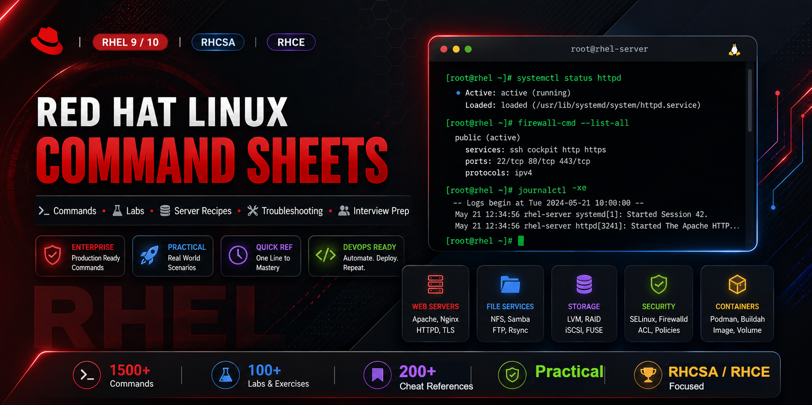

<p align="center">
  
</p>

<h1 align="center">Red Hat Linux Command Sheets</h1>

<p align="center">
  Tutorial-style RHEL 9/10 command notes, hands-on labs, server recipes, troubleshooting scenarios, and interview preparation.
</p>

<p align="center">
  <a href="LICENSE"></a>
  
  
</p>

---

## Start Here

Choose the path that matches what you are doing right now.

### New To RHEL

Start with the [full syllabus](syllabus/README.md), then read the matching [core docs](docs/README.md). Each topic explains the idea first, then gives commands, verification, mistakes, and interview points.

### Build Hands-On Skill

Use the [hands-on labs](labs/README.md) in a disposable VM. The labs are written for repetition: do the task, verify it, clean it up, then explain what happened.

### Practice Troubleshooting

Use [scenarios](scenarios/README.md) when you want real-world diagnostic thinking: symptoms, likely causes, decision flow, fixes, and spoken interview answers.

### Prepare For Interviews

Use [interview prep](interview/README.md) after each topic. Practice answers out loud using this order: current state, evidence, likely cause, fix, verification.

### Look Up Commands

Use [cheatsheets](cheatsheets/README.md) when you already understand the concept and only need a command, path, port, or config file quickly.

## Repository Sections

### Core Learning

- [Core administration docs](docs/README.md): tutorial-style notes for RHEL fundamentals.
- [Full syllabus](syllabus/README.md): course path from basics to troubleshooting.
- [General notes](notes/README.md): admin mindset, safe habits, and revision drills.

### Practice And Troubleshooting

- [Hands-on labs](labs/README.md): VM-based practice tasks.
- [Troubleshooting scenarios](scenarios/README.md): realistic failure cases and diagnostic flows.
- [Server recipes](servers/README.md): deploy and verify common services.

### Fast Review

- [Cheatsheets](cheatsheets/README.md): compact lookup references.
- [Interview prep](interview/README.md): spoken answers and scenario-based questions.

## Study Flow

```text
Syllabus -> Core Docs -> Labs -> Scenarios -> Interview Q&A -> Server Recipes
```

Use this loop for every topic:

1. Read the concept.
2. Run the commands in a VM.
3. Verify the result.
4. Break one thing intentionally.
5. Troubleshoot it from logs and evidence.
6. Explain the fix out loud.

## Quick Diagnostic Flow

For most RHEL issues, avoid guessing. Move through evidence in this order:

```text
service state -> logs -> listen address/port -> firewall -> SELinux -> permissions -> storage/DNS/packages
```

Useful first commands:

```bash
systemctl --failed
journalctl -p err -b --no-pager
systemctl status <service>
journalctl -u <service> -b --no-pager
sudo ss -tulpn
sudo firewall-cmd --list-all
getenforce
sudo ausearch -m AVC -ts recent
df -hT
```

## Safety

Many commands in this repository change system state. Practice in a VM, take backups before editing config files, and replace placeholders such as `<hostname>`, `<interface>`, `<device>`, `<mountpoint>`, `<user>`, and `<service>` before running commands.

## Official References

- RHEL 10 documentation: <https://docs.redhat.com/en/documentation/red-hat-enterprise-linux>
- RHEL 9 documentation: <https://docs.redhat.com/en/documentation/red_hat_enterprise_linux/9>
